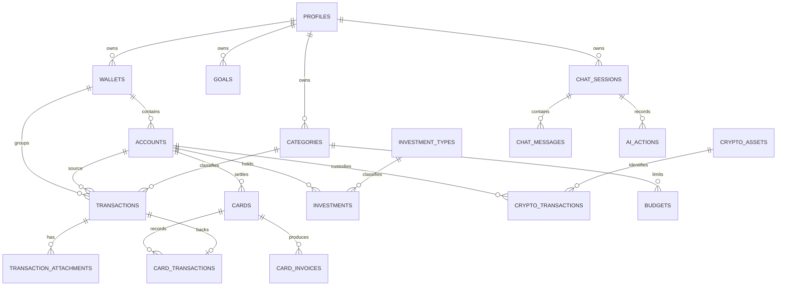

# Modelo de Dados — Finance AI

## Fonte de verdade

As migrations SQL em [`supabase/migrations`](../supabase/migrations) são a única fonte de verdade do schema. O editor visual do Supabase não deve ser utilizado para alterações estruturais.

Valores fiduciários são `bigint` em unidades menores (`*_minor`; por exemplo, R$ 40,50 = `4050`). Quantidades de cripto usam `numeric(30,12)`. Essa escolha elimina os erros de ponto flutuante; o trade-off é que conversão para exibição é obrigatória na camada de apresentação.

## Diagrama ER

`transactions` é o livro-razão canônico: receita, despesa, transferência, investimento, compra/venda de cripto e reembolso são diferenciados por enum. As tabelas de cartões, investimentos e cripto acrescentam atributos específicos, mas nunca duplicam o lançamento financeiro.

## ENUMs

- `transaction_type`: `income`, `expense`, `transfer`, `investment`, `crypto_buy`, `crypto_sell`, `refund`.
- `transaction_status`: `pending`, `paid`, `cancelled`, `scheduled`.
- `payment_method`: PIX, dinheiro, cartão de crédito/débito, transferência e cripto.
- `crypto_operation_type`, `goal_status` e `ai_action_status` controlam estados finitos sem strings livres.

Enums oferecem integridade e consultas compactas. Para novos tipos, uma migration explícita é necessária — um custo deliberado para não aceitar valores inválidos silenciosamente.

## Segurança e RLS

Todas as tabelas de propriedade do usuário têm `user_id`, RLS habilitada e políticas com `user_id = auth.uid()`. Tabelas de referência (`currencies`, tipos de investimento, ativos cripto e templates de categoria) são somente leitura para usuários autenticados. `audit_logs` também é somente leitura pelo cliente; funções de banco e Edge Functions registram os eventos.

Triggers verificam que carteira, contas e categoria de cada transação pertencem ao mesmo usuário. Isso complementa RLS, pois uma chave estrangeira sozinha não garante propriedade.

## Índices e performance

Os índices parciais em transações filtram `deleted_at is null` e cobrem as consultas mais frequentes: usuário/data, carteira/data, conta/data, categoria/data e tipo/status. Há índices de sessão de chat, notificações não lidas e trilha de auditoria. Índices parciais reduzem tamanho e custo de escrita quando há histórico soft-deleted.

Views com `security_invoker=true` fornecem saldo, patrimônio, resumo mensal/anual e carteiras de investimento/cripto sem contornar RLS. Para escala maior, `monthly_reports` é o cache persistido de agregados mensais, atualizado por trigger; relatórios pesados futuros podem evoluir para views materializadas atualizadas por job.

## Funções e triggers

- `set_updated_at()` atualiza timestamps automaticamente.
- `calculate_balance()` e `calculate_net_worth()` calculam projeções de saldo e patrimônio.
- `monthly_summary()`, `year_summary()` e `goal_progress()` são contratos SQL para relatórios.
- `refresh_transaction_projections()` atualiza saldo de conta, orçamento e relatório mensal após alterações no livro-razão.
- `write_audit_log()` preserva eventos de alteração nas entidades financeiras críticas.

Não há exclusão física no fluxo normal: todas as entidades de usuário possuem `deleted_at`. Isso protege histórico e auditoria; jobs de retenção só devem remover anexos órfãos após uma política de compliance definida.

## Migrations e seed

As migrations são separadas por responsabilidade: extensões, perfil, carteira/conta, categorias, transações, cartões, investimentos, cripto, metas/orçamentos, relatórios, chat, dados auxiliares, índices, RLS, views/funções, referências e triggers. O seed em [`supabase/seed/001_reference_data.sql`](../supabase/seed/001_reference_data.sql) contém moedas, tipos de investimento, criptoativos e categorias padrão.
